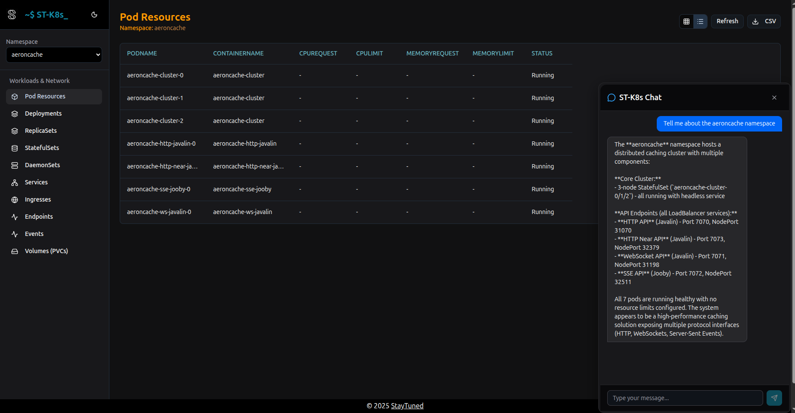

<a id="top"></a>
# ST-K8s

View and chat to your Kubernetes cluster.


Features a dashboard (with a K9s inspired dark theme), REST API, and MCP server. In browser AI chat powered by the Copilot SDK (technical preview). 
Integrates with VSCode and Copilot.




## Table of Contents

- [How to Run](#how-to-run)
- [API](#api)
- [Model Context Protocol (MCP) Server](#model-context-protocol-mcp-server)
  - [Features](#features)
  - [Running the MCP Server](#running-the-mcp-server)
  - [Configuring for VSCode](#configuring-for-vscode)
  - [Configuring for Claude Desktop](#configuring-claude-for-desktop)

## How to Run

```bash
git clone https://github.com/bhf/st-k8s
npm run build
npm run start
```

To use the browser based chat feature make sure you install the [Copilot SDK](https://github.com/github/copilot-sdk).

[Back to Top](#top)

## API

Swagger spec available at `http://localhost:3000/openapi.json` after starting the server or from the public folder.

[Back to Top](#top)

## Model Context Protocol (MCP) Server

This project includes an MCP server that exposes Kubernetes tools to LLMs over stdio. Here are some example uses:

* List of pods
* Rank containers by their memory requests and limits
* Summary of the last events in the namespace


[Back to Top](#top)

### Features
Exposes read-only Kubernetes operations as tools:
- `list_namespaces`
- `list_pods`
- `list_deployments`
- `list_services`
- `list_daemonsets`
- `list_replicasets`
- `list_statefulsets`
- `list_ingresses`
- `list_endpoints`
- `list_events`
- `list_pvcs`

[Back to Top](#top)

### Running the MCP Server

Make sure to auth your kubectl context in your preferred way before running the MCP server.

You can run the MCP server directly using:

```bash
npm run mcp
```

You can also run it from VSCode or any MCP-compatible client by configuring it as shown below.

[Back to Top](#top)

### Configuring for VSCode

Add the following to your ```mcp.json```

```json
{
  "servers": {
    "k8s-tools": {
      "command": "npm",
      "args": ["run", "mcp"],
      "cwd": "/absolute/path/to/st-k8s",
      "disabled": false,
      "autoApprove": [] 
    }
  }
}

```

[Back to Top](#top)

### Configuring Claude for Desktop

Add the following configuration to your Claude for Desktop config file (usually `~/Library/Application Support/Claude/claude_desktop_config.json` on macOS or `%APPDATA%\Claude\claude_desktop_config.json` on Windows):

```json
{
  "mcpServers": {
    "k8s-tools": {
      "command": "npm",
      "args": ["run", "mcp"],
      "cwd": "/absolute/path/to/st-k8s",
      "env": {
        "KUBECONFIG": "/absolute/path/to/your/kubeconfig"
      }
    }
  }
}
```

Make sure to replace `/absolute/path/to/st-k8s` with the actual path to this repository on your machine.

[Back to Top](#top)
