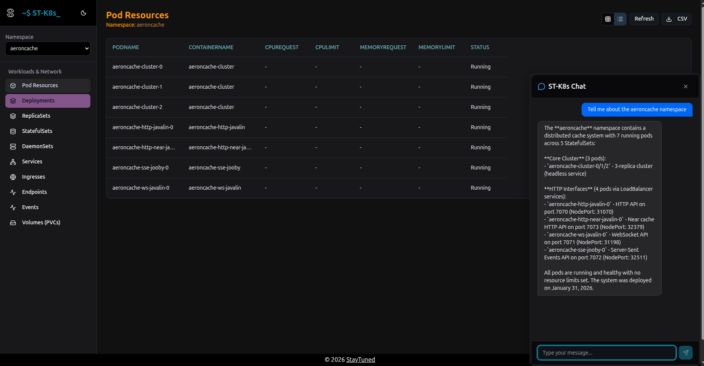
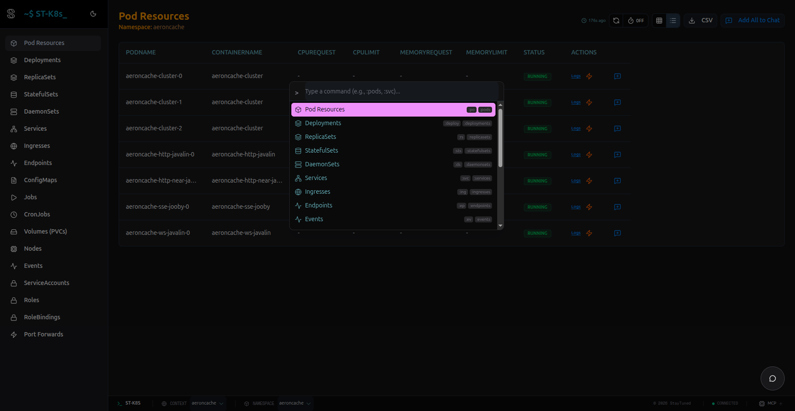
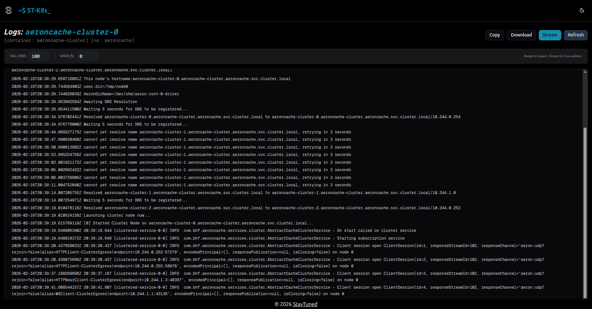
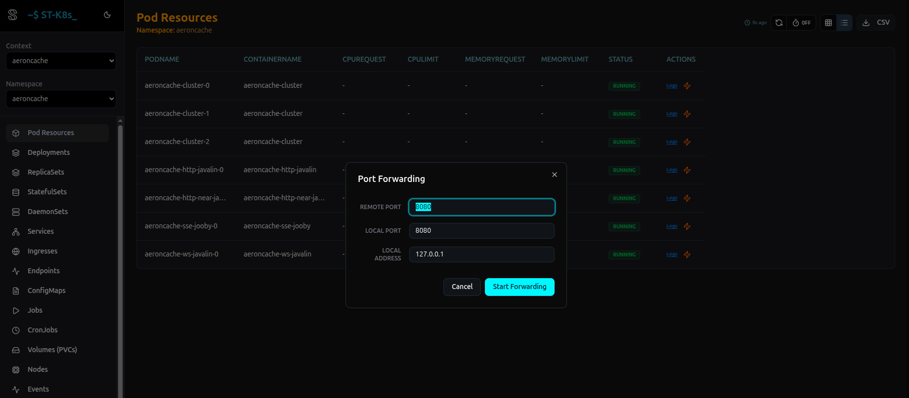
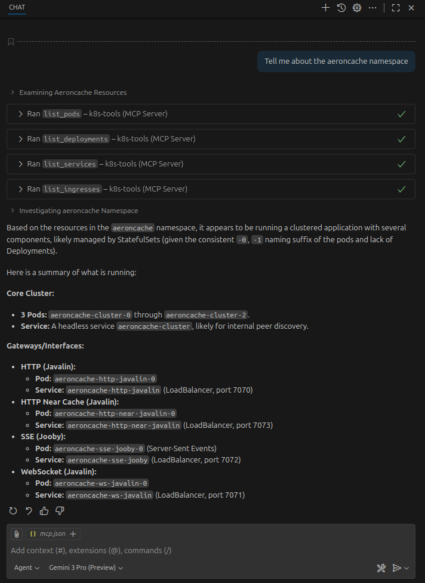
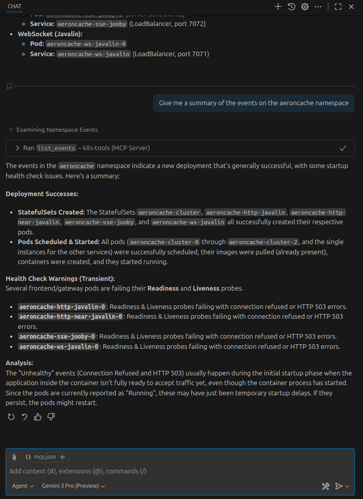
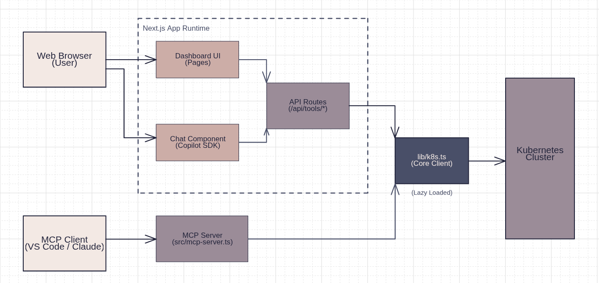

<a id="top"></a>
[](https://sanjeev.pages.dev)
# ST-K8s

[](https://github.com/bhf/st-k8s/actions/workflows/build.yml)
[](https://github.com/bhf/st-k8s/actions/workflows/test.yml)
[](https://github.com/bhf/st-k8s/actions/workflows/playwright.yml)


View and chat to your Kubernetes cluster.


Features a dashboard (with a K9s inspired dark theme and keyboard navigation), REST API, port forwarding management, resource monitoring, and MCP server. In browser AI chat powered by the Copilot SDK (technical preview). 
Integrates with VSCode and Copilot.



Uses [Github Projects](https://github.com/users/bhf/projects/5) for planning and tracking.

## Keyboard Navigation

The dashboard supports K9s-style keyboard navigation. Press `:` to open the command palette and navigate between resources using commands or aliases:

- `:pods` or `:po`
- `:deployments` or `:deploy`
- `:services` or `:svc`
- ...and many more standard K8s shortcuts.



## Log Viewer

View, copy and download streaming logs.



## Port Forwarding

Manage Kubernetes port forwarding sessions directly from the dashboard or through AI chat. Supports both Pods and Services.

- **Dynamic Config**: Specify target ports and local interface bindings.
- **Service Mapping**: Automatically resolves Service targets to active Pods.
- **Agentic Control**: Start or stop forwards using natural language through the Copilot integration or MCP server.



## Resource Monitoring

Monitor CPU and memory usage for Nodes and Pods directly in the dashboard using interactive charts.

- **Real-time Data**: Fetches live metrics from the Kubernetes Metrics Server.
- **Node Metrics**: View cluster-wide resource utilization across all nodes.
- **Pod Metrics**: Inspect resource consumption for individual pods in any namespace.
- **Visual Charts**: Interactive Recharts-based visualizations for easier performance analysis.

## Table of Contents

- [ST-K8s](#st-k8s)
  - [Keyboard Navigation](#keyboard-navigation)
  - [Log Viewer](#log-viewer)
  - [Port Forwarding](#port-forwarding)
  - [Resource Monitoring](#resource-monitoring)
  - [Table of Contents](#table-of-contents)
  - [How to Run](#how-to-run)
    - [Using the `st-k8s` CLI](#using-the-st-k8s-cli)
    - [Running Tests](#running-tests)
    - [End-to-End Tests](#end-to-end-tests)
  - [API](#api)
  - [Model Context Protocol (MCP) Server](#model-context-protocol-mcp-server)
    - [Features](#features)
    - [Running the MCP Server](#running-the-mcp-server)
    - [Configuring for VSCode](#configuring-for-vscode)
  - [LLM Integration Techniques](#llm-integration-techniques)
  - [High Level Architecture](#high-level-architecture)
  - [Accessibility](#accessibility)
  - [Security](#security)

## How to Run

```bash
git clone https://github.com/bhf/st-k8s
npm run build
npm run start
```

### Using the `st-k8s` CLI

You can install the project as a global CLI to run the app using the `st-k8s` command.

```bash
# From the repo root — install globally (or publish and install from a registry)
npm install -g .

# During development, link the local package to make `st-k8s` available globally
npm link

# Then launch the app with the CLI (it will build if no build exists)
st-k8s
```

Notes:
- `npm install -g .` requires appropriate permissions (use `sudo` on some systems).
- `npm link` is useful when iterating locally — run it once from the repo root.
- The `st-k8s` command will attempt to use a Next.js standalone server if present (from `next build`), otherwise it runs `npm run start`.

### Running Tests

This project uses [Vitest](https://vitest.dev/) for testing.

```bash
# Run all tests
npm test

# Run tests in watch mode
npm test -- --watch

# Run tests with coverage
npm run test:coverage
```

### End-to-End Tests

This project uses [Playwright](https://playwright.dev/) for End-to-End testing.

```bash
# Run E2E tests
npm run test:e2e
```

To use the browser based chat feature make sure you install the [Copilot CLI](https://github.com/github/copilot-cli).

[Back to Top](#top)

## API

Swagger spec available at `http://localhost:3000/openapi.json` after starting the server or from the public folder.

[Back to Top](#top)

## Model Context Protocol (MCP) Server

This project includes an MCP server that exposes Kubernetes tools to LLMs over stdio. Here are some example uses:

* List of pods
* Rank containers by their memory requests and limits
* Summary of the last events in the namespace
* Get the last 100 lines of logs for a specific pod






[Back to Top](#top)

### Features
Exposes read-only Kubernetes operations as tools:
- `list_namespaces`
- `list_pods`
- `list_deployments`
- `list_services`
- `list_daemonsets`
- `list_replicasets`
- `list_statefulsets`
- `list_ingresses`
- `list_endpoints`
- `list_events`
- `list_pvcs`
- `list_nodes`
- `list_configmaps`
- `list_jobs`
- `list_cronjobs`
- `list_serviceaccounts`
- `list_roles`
- `list_rolebindings`
- `get_pod_logs`
- `list_port_forwards`
- `start_port_forward`
- `stop_port_forward`
- `get_node_metrics`
- `get_pod_metrics`

[Back to Top](#top)

### Running the MCP Server

Make sure to auth your kubectl context in your preferred way before running the MCP server.

You can run the MCP server directly using:

```bash
npm run mcp
```

You can also run it from VSCode or any MCP-compatible client by configuring it as shown below.

[Back to Top](#top)

### Configuring for VSCode

Add the following to your ```mcp.json```

```json
{
  "servers": {
    "k8s-tools": {
      "command": "npm",
      "args": ["run", "mcp"],
      "cwd": "/absolute/path/to/st-k8s",
      "disabled": false,
      "autoApprove": [] 
    }
  }
}

```

Make sure to replace `/absolute/path/to/st-k8s` with the actual path to this repository on your machine.

[Back to Top](#top)

## LLM Integration Techniques

This project uses several LLM-based techniques to enhance the development lifecycle and user experience. These artifacts are located in the `.github` directory:

*   **Agents**: Domain-specific personas which embody specialized knowledge for consistent code generation.
    -   [Expert Next.js Developer](.github/agents/expert-nextjs-developer.agent.md)
*   **Instructions**: Contextual guidelines that enforce coding standards and architectural patterns.
    -   [Project Overview](.github/copilot-instructions.md)
    -   [Next.js + Tailwind Standards](.github/instructions/nextjs-tailwind.instructions.md)
*   **Skills**: Reusable capabilities that allow the model to perform complex tasks.
    -   [Copilot SDK](.github/skills/copilot-sdk/SKILL.md)
    -   [Excalidraw Diagram Generator](.github/skills/excalidraw-diagram-generator/SKILL.md)
*   **Prompts**: Curated prompt templates ensuring high-quality, reproducible outputs for specific tasks.
    -   [Clean Excalidraw](.github/prompts/clean-excalidraw.prompt.md)
    -   [Create Issue](.github/prompts/createIssue.prompt.md)

[Back to Top](#top)

## High Level Architecture



[Back to Top](#top)

## Accessibility

We are committed to making the dashboard accessible to all users. Please refer to our [Accessibility Statement and Guidelines](docs/a11y.md) for details on current status, findings, and remediation plans.

## Security

We take security seriously. Please refer to our [Security Review](docs/security-review.md) for details on our security posture, findings, and recommendations.

[Back to Top](#top)
